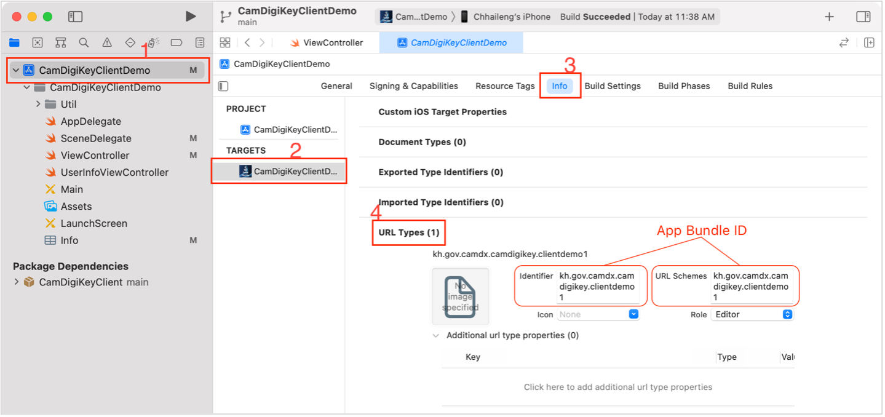

# Sample Code for CamDigiKey Integration with iOS

To integrate app-to-app authentication with CamDigiKey app, a client must have an API server which its endpoints communicate with CamDigiKey server using CamDigiKey client library. Then, client mobile application requests to client API server to get `loginToken`. The following are the iOS integration steps:

## 1. Create s DeepLink URL Scheme

- In the Xcode project, click on the project name and select your project target
- Open **Info** tab and expand **URL Types**
- Click + and enter App bundle ID as Identifier and URL Schemes



- Alternately, you can create a DeepLink URL Scheme via `info.plist` file as follow:

```xml
<key>CFBundleURLTypes</key> 
<array> 
    <dict> 
        <key>CFBundleTypeRole</key> 
        <string>Editor</string> 
        <key>CFBundleURLName</key> 
        <string>kh.gov.camdx.camdigikey.clientdemo1</string> 
        <key>CFBundleURLSchemes</key> 
        <array> 
            <string>kh.gov.camdx.camdigikey.clientdemo1</string> 
        </array> 
    </dict> 
</array> 
```

---

## 2. Create a Protocol for CamDigiKey delegate function

```swift
protocol CamDigiKeyClientDelegate {
    func didAuthorizedLoginRequest(authToken: String)
    func didFailAuthorizedLoginRequest(message: String)
}
```

---

## 3. Create a View Controller class for awaiting screen (use when CamDigiKey App is opened)

```swift
class AwaitingAuthorizationVC: UIViewController {
    var delegate: CamDigiKeyClientDelegate?

    override func viewDidLoad() {
        super.viewDidLoad()
        
        // MARK : Add your own design for awaiting screen
    }
}

```

---

## 4. Login With CamDigiKey

- Inside the function which handles login button, request to client API server to get `loginToken`
- Once the `loginToken` is responded, call `loginWithCamDigiKey` function

```swift
@IBAction func loginWithCamDigiKey(_ sender: UIButton) {
    // MARK : Step 1. Add your logic for requesting `loginToken` from Client API Server
    let loginToken = "LOGIN_TOKEN_RESPONDED_FROM_CLIENT_API_SERVER"
    // MARK : Step 2. Generate login request with `loginToken` to CamDigiKey App
    let url = URL(string: "camdigikey://login?token=\(loginToken)")
    UIApplication.shared.open(url!) { (result) in
        if result {
            let awaitingVC = AwaitingAuthorizationVC()
            awaitingVC.modalPresentationStyle = .fullScreen
            awaitingVC.delegate = self
            self.present(awaitingVC, animated: true, completion: nil)
        } else {
            // MARK : Add your logic to handle when CamDigiKey App can't be opened
        }
    }
}

```

- Once user authorized the login request in CamDigiKey app, an `authToken` will be returned and passed to client app via DeepLink. `LoginViewController` can get `authToken` by conform to `CamDigiKeyClientDelegate`.

```swift
extension LoginViewController: CamDigiKeyClientDelegate {  
    func didAuthorizedLoginRequest(authToken: String) {
        print("Login success, authToken: \(authToken)")
        // MARK : Step 3. Add your logic to request for `accessToken` with `authToken` from Client API Server        
        // MARK : Step 4. Add your logic to request for user information with `accessToken` from Client API Server        
    }  
    func didFailAuthorizedLoginRequest(message: String) {
        // MARK : Add your logic to handle authorization failed
        print("Login failed, message: \(message)")
    }  
}
```

---

## 5. Handling DeepLink for Login Callback

- In `SceneDelegate`, override a function as following

```swift
extension SceneDelegate {
    func scene(_ scene: UIScene, openURLContexts URLContexts: Set<UIOpenURLContext>) {
        let rootVC = window?.rootViewController
        if let awaitingVC = rootVC?.presentedViewController as? AwaitingAuthorizationVC {
            if let urlContext = URLContexts.first, let host = urlContext.url.host, host == "camdigikey_login_callback" {
                let data = URLComponents(url: urlContext.url, resolvingAgainstBaseURL: false)?.queryItems?.first
                if data?.name == "authToken" {
                    awaitingVC.dismiss(animated: true) {
                        if let authToken = data?.value {
                            awaitingVC.delegate?.didAuthorizedLoginRequest(authToken: authToken)
                        } else {
                            awaitingVC.delegate?.didFailAuthorizedLoginRequest(message: "No Auth Token")
                        }
                    }
                } else {
                    awaitingVC.dismiss(animated: true) {
                        awaitingVC.delegate?.didFailAuthorizedLoginRequest(message: data?.value ?? "no errorMessage")
                    }
                }
            }
        } else {
            // MARK : Add your logic to handle when login request has been canceled
        }
    }
}
```

---

## Contact us

- Tel: +855 81 922 329
- Email: info@techostartup.center
- Address: RUPP's Compound Russian Federation Blvd., Toul Kork, Phnom Penh, Cambodia